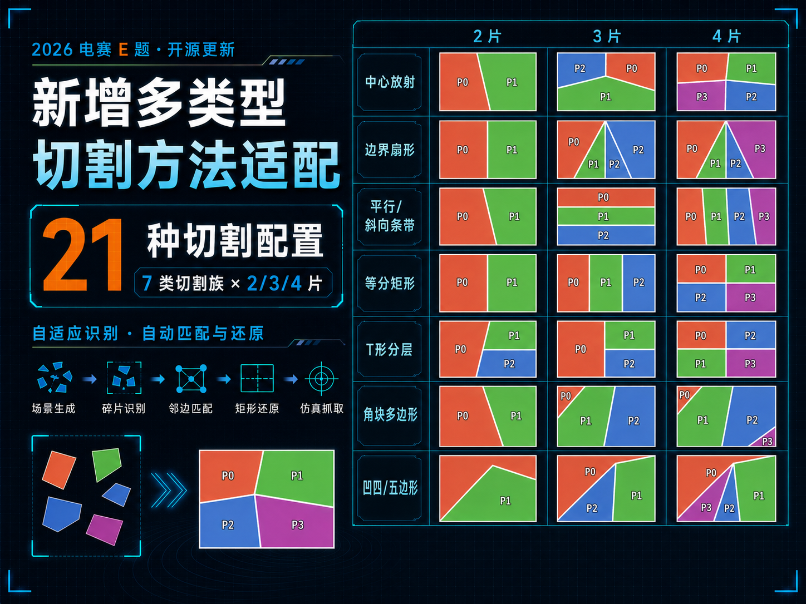
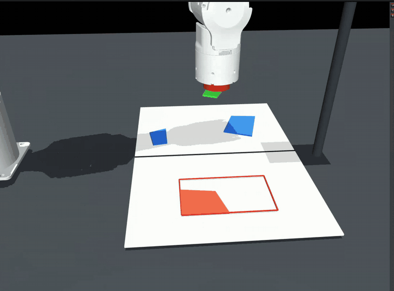
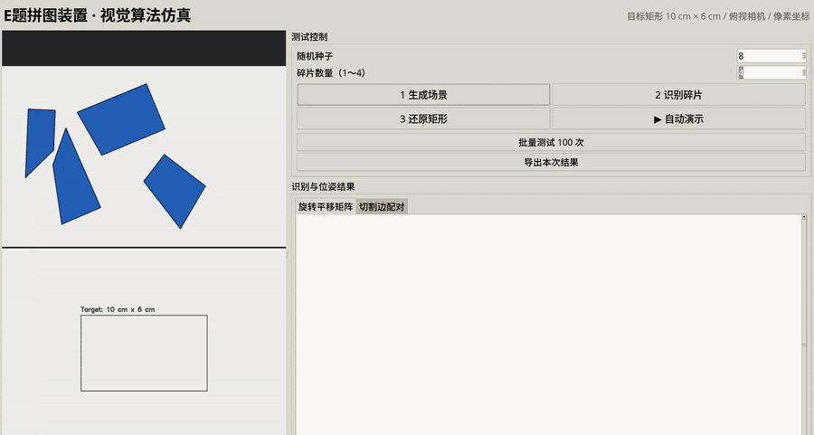
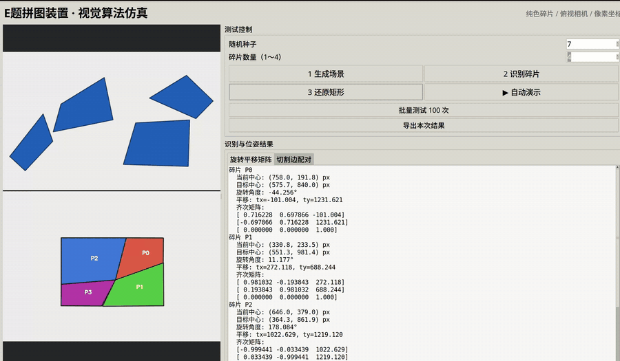

# 2026 年全国大学生电子设计竞赛 E 题：拼图装置

> **完赛展示版 · 全流程识别抓取仿真**
>
> 当前主页版本已经覆盖随机切割、纯视觉识别、拼接规划、PIPER-L 正/逆运动学、
> 五次轨迹规划、电磁铁吸附、逐块搬运与最终复位的完整闭环流程。

<p align="center">
  
</p>

## v2.1 多切割拓扑适配版

本版本在 `v2.0.0-full-pipeline` 全流程机械臂仿真的基础上新增多种赛题合法
切割拓扑，旧版本和历史标签继续保留。界面统一支持2～4片，并提供7类切割族、
21种“类别×片数”配置：

- 中心放射、边界扇形与平行/斜向条带；
- 2×2四块相同矩形及2～3片等分矩形；
- 单/双T点分层切割与部分边匹配；
- 角块三角形、中央四/五边形组合；
- 凹四/五边形折线切割与凹片复合；
- 全类型随机选择、纯白卡纸和大鬼扑克牌两种表面；
- 高倍速IPC位姿帧合并，减少放置前等待和末块完成延迟。



完整的拓扑定义、赛题边数/边长/外边界约束、21种高清切割对比图和已知边界，
见[矩形拼图切割方式研究](docs/切割方式研究.md)。

> 面向 2026 年全国大学生电子设计竞赛赛区赛（TI 杯）暨模拟电子系统设计
> 专题赛选拔赛 E 题“拼图装置”的视觉算法仿真、拼接求解与位姿输出程序。

这个项目生成一张随机切成 2～4 个多边形的矩形卡纸，把碎片随机旋转、平移并
保持安全间距地摆放在 A4 纸上半区，然后**只从仿真摄像头图像**完成：

1. 颜色分割与多边形轮廓识别；
2. 根据切割边长度配对恢复碎片邻接关系；
3. 通过刚体变换与全局闭环优化拼回矩形；
4. 输出每块碎片从当前位置到下半区目标矩形的 3×3 齐次旋转平移矩阵。
5. 按 P0、P1…的顺序实时播放每块碎片旋转、平移到目标位置的动画。
6. 通过 PIPER-L 六轴机械臂逆解和五次轨迹依次抓取、搬运、对齐和释放碎片。
7. 使用第六轴带动电磁铁与碎片刚性同步旋转，任务结束后折叠复位。

## 完赛版全流程演示



动图自动循环展示摄像头视觉识别、机械臂逆解与平滑轨迹、电磁铁下表面吸附、
目标上方第六轴对齐、物理释放及矩形还原全过程，无需点击播放。

## 版本说明

- **当前主页：完赛全流程版**
  视觉主界面与独立 MuJoCo 窗口同步，包含摄像头、A4 纸、随机碎片、PIPER-L
  URDF/STL、正逆运动学、轨迹规划、电磁铁抓放和多切割拓扑。
- **多切割拓扑版：`v2.1.0-cut-topologies`**
  新增7类切割族、21种2/3/4片配置、凹多边形与相同矩形专项求解。
- **全流程基础版：`v2.0.0-full-pipeline`**
  保留新增多切割拓扑之前的机械臂全流程仿真版本。
- **历史纯视觉版：`vision-only-v1.0`**
  保留原始随机切割、视觉识别、拼接求解与二维动画版本，可通过 Git 标签下载，
  不会被当前版本覆盖。

碎片数量可在界面中设置为 2～4。算法根据数量生成直线切割或中心放射切割，
每块都有矩形外边，符合赛题“不超过 4 片、每片不超过 5 边、每片至少一条边位于目标矩形外边”的约束。
仿真目标矩形固定为 **10 cm × 6 cm**，使用 40 px/cm 的比例渲染为
400 px × 240 px；切割、还原与位姿输出共用这一尺寸定义。比赛手册对现场
目标矩形规定的范围是 **9 cm × 5 cm～12 cm × 9 cm**，因此 10 cm × 6 cm
处于允许范围内。

“卡片素材”可切换“纯色卡纸”和“大鬼扑克牌”。扑克牌模式先把一张完整
Joker 牌面切成随机碎片，再随机旋转和平移；二维页面、俯视相机和 MuJoCo
窗口同步显示。视觉检测通过工作平面背景建模提取外轮廓，拼接规划只使用
多边形顶点、切割边长度与邻接关系，不读取牌面纹理或生成真值。演示使用项目
用户提供的“大王”牌面，经无拉伸旋转和居中裁切适配 10:6 目标比例；素材说明
见 `mujoco_sim/assets/cards/ASSET_LICENSE.md`。

工作面按赛题演示要求设置为黑色 A4 纸，纯色模式使用白色碎片，扑克牌模式
使用白底带花纹的完整牌面。“切割方式”提供以下分类：

- **中心放射（原版）**：3～4 条内部边汇聚于公共中心；
- **边界扇形**：切割线共享矩形外边界上的公共点；
- **平行斜向条带**：横向、纵向或斜向随机间距分割，无公共顶点；
- **等分矩形**：四块时采用2×2等分，四片均为5 cm×3 cm相同矩形；
- **凹五边形折线切割**：保留真实凹顶点，支持凹片与三/四边形混合拼接；
- **T 形分层切割**：一条长边对应两块碎片的短边，使用部分边匹配；
- **角块多边形**：两个角部三角形与中央四/五边形组合；
- **全类型随机**：按随机种子从上述类别中选择，类别本身仍作为视觉求解的
  拓扑约束，不读取碎片位姿或邻接真值。

完整边类别通过 N−1 条切割边构建通用邻接图；T 形类别同时枚举长边首段和
末段的部分匹配，并由目标面积、10:6 长宽比、矩形覆盖率、重叠量和外轮廓
闭合度共同选择解。

切割拓扑、覆盖范围、凹多边形支持边界及分类对比图详见
[矩形拼图切割方式研究](docs/切割方式研究.md)。

## 演示

### 逐块实时运动与拼接



动画展示视觉识别完成后，P0、P1、P2、P3 依次按照求解出的旋转和平移矩阵，
运动到 10 cm × 6 cm 目标矩形并完成拼接。GIF 会在 GitHub 页面自动循环播放。

### 4 块碎片


[查看 4 块碎片高清 WebM 演示](docs/media/demo-4-pieces.webm)

### 3 块碎片



[查看 3 块碎片高清 WebM 演示](docs/media/demo-3-pieces.webm)

## 与 2026 年电赛 E 题的对应关系

| 赛题视觉需求 | 本项目实现 |
| --- | --- |
| 待拼接碎片不超过 4 片 | 界面可设置 2～4 片 |
| 每片不超过 5 条边 | 仿真生成的碎片最多 5 条边 |
| 每片至少一条边位于目标矩形外边 | 切割生成器保证每片包含矩形外边 |
| 随机摆放后自动识别 | 颜色分割、轮廓提取、多边形顶点识别 |
| 拼接成目标矩形 | 切割边配对、邻接恢复、刚体拼接与全局闭环误差优化 |
| 目标矩形尺寸 | 固定为 10 cm × 6 cm |
| 机械臂移动所需位姿 | 输出每片的旋转角、平移量及 3×3 齐次矩阵 |
| 展示移动过程 | 按碎片编号依次播放实时旋转和平移动画 |
| 正常室内照明 | 算法接口可替换为标定后的真实相机图像 |

本仓库实现的是视觉算法与拼接求解仿真。接入真实机械臂时，还需完成相机标定、
像素到工作台坐标转换、手眼标定、抓取点规划及机械臂运动控制。

## 生成与识别的数据隔离

生成阶段和视觉阶段通过图像边界隔离：

```text
随机切割多边形 + 随机真值位姿
              │
              ▼
          渲染/PNG 编码
              │
              ▼
        PNG 解码后的相机像素
              │
              ├── 颜色分割与轮廓检测
              ├── 切割边配对与邻接恢复
              └── 全局拼接规划与位姿矩阵
```

`generate_camera_frame()` 只返回图像像素，不返回生成多边形、顶点、邻接关系或
真值旋转平移矩阵。`analyze_camera_frame()` 只接收图像；碎片数量也由图像轮廓
自动统计。界面中的“碎片数量”只控制生成器，不作为识别或拼接求解输入。
因此视觉结果可替换为真实相机图片，不依赖仿真生成数据。

隔离回归测试：

```bash
python3 -m unittest tests/test_image_isolation.py
```

## 运行

### MuJoCo 机械臂全流程仿真

独立的 [`mujoco_sim/`](mujoco_sim/) 目录提供机械臂、电磁铁、俯视相机、A4
纸和随机多边形碎片的完整物理仿真。它通过相机像素调用视觉算法，依次执行
接近、吸附、抬升、搬运、释放并完成 10 cm × 6 cm 拼图，不读取碎片生成真值。

```bash
pip install -r mujoco_sim/requirements.txt
./mujoco_sim/run_ui.sh
python3 -m mujoco_sim.run_sim --pieces 4 --seed 7
```

联动模式会同时打开原视觉算法主窗口与独立 MuJoCo 窗口。主窗口的随机种子、
碎片数量、生成、识别、还原和动画速度会同步控制 PIPER-L 仿真；二维拼接
画面由机械臂实际进度驱动。机械臂 URDF/STL 已复制到本项目，运行时不依赖也
不影响原“艾灸机器人”控制站。

详见 [MuJoCo 仿真说明](mujoco_sim/README.md)。

### 原视觉算法界面

可视化测试界面：

```bash
python3 puzzle_gui.py
```

界面可按“生成场景 → 识别碎片 → 还原矩形”单步测试，也可自动演示、批量测试
100 个随机场景，并在右侧查看每块碎片的旋转角、平移量和 3×3 齐次矩阵。

命令行版本：

```bash
python3 puzzle_sim.py
```

指定随机种子并批量验证：

```bash
python3 puzzle_sim.py --seed 12 --output output/demo
python3 puzzle_sim.py --seed 12 --pieces 3 --output output/three
python3 puzzle_sim.py --batch 100
```

单次运行输出：

- `scene.png`：随机摆放的相机输入；
- `detected.png`：视觉识别出的轮廓、顶点与编号；
- `solution.png`：目标矩形及还原结果；
- `transforms.json`：每片的中心、角度、2×3 与 3×3 变换矩阵；
- `summary.png`：输入、识别、还原三联图。

矩阵采用图像像素坐标（x 向右、y 向下）。对当前图像中的点 `[x, y, 1]^T` 左乘 `matrix_3x3`，即可得到目标矩形中的对应位置。机械臂使用时，再通过相机标定得到的单应矩阵/手眼标定矩阵，把像素位姿转换为工作台或机器人坐标。

## 算法边界

当前版本支持纯色卡纸与完整大鬼扑克牌，假设碎片不接触、不遮挡、透视畸变
较小。真机建议先做相机畸变校正和工作平面单应性校正，并保持牌面与工作台有
足够亮度或色彩差异。当前扑克牌演示仍严格采用几何拼接；如需处理切割边长度
高度相似的任意商业牌面，可在多个几何可行解之间增加纹理接缝代价。
